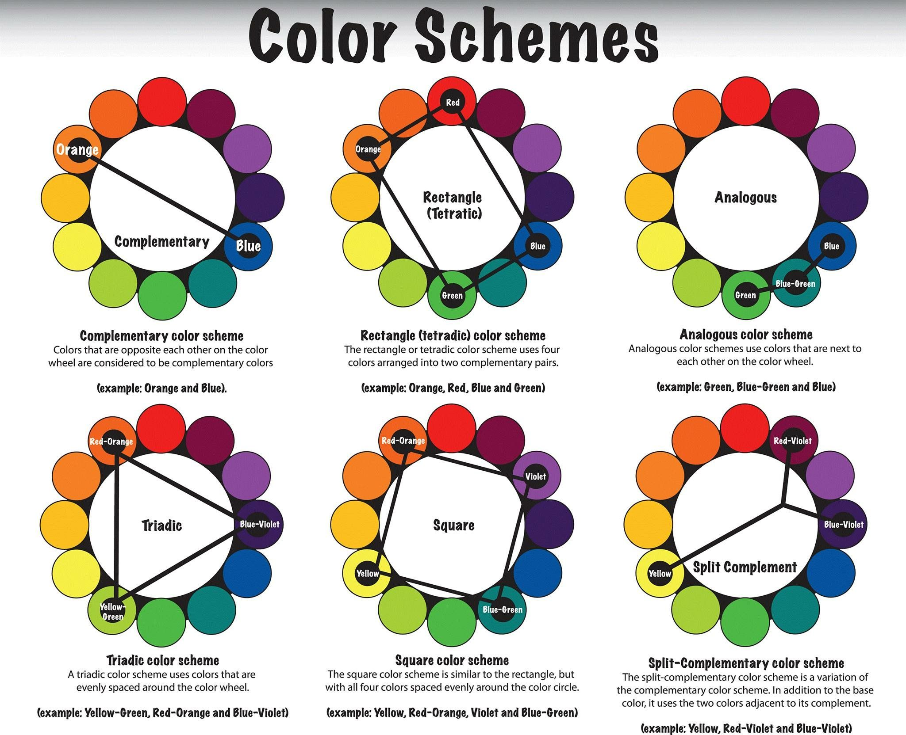

Этот документ содержит фреймворки и чеклисты, которые позволят разработать удобный пользовательского интерфейса (UI) без глубоких познаний в дизайне. 
# Делаем черновик
## Фокус на функциональности

Многие дизайн системы требуют перед началом настроить конфигурацию и даже layout (сетку расположения блоков на странице, типа "хедер, сайдбар, контент, футер"). Однако, для разработки дизайна UI это неправильный подход.

Начни с куска функциональности — фичи.

Что делает приложение? Если это форма, которая принимает данные и выдаёт результаты, расположите только элементы этой формы. Большего пока не нужно.

## Крупными мазками

На этом этапе важно не утонуть в деталях. Рисуя макет, используй инструмент с жирным начертанием (типа маркера). С ним отвлечься на детали будет просто невозможно и ты сконцентрируешься на расположении основных элементов.

## Без цветов

После расположения основных элементов можно переходить к более мелким. Но лучше всего это делать без цветов, в монохромной палитре.

Такой подход покажется более сложным, но он заставит использовать отступы, контраст, толщину и размер, чтобы получить лучшую иерархию элементов в UI.

> [!tip] Двигайся быстро, не думай о деталях и всех возможных вариантах. Используй как можно больше черновиков чтобы изучать идеи и не бойся их отбрасывать

## Чередуй дизайн с кодом

Вкратце алгоритм такой:
1. Набросок UI для куска функциональности
2. Реализация в коде

Идея в том, чтобы решать возникающие проблемы дизайна сразу в коде, в живом интерфейсе. При этом ожидай трудностей в реализации, поэтому релизь в первую очередь минимальную функциональность, сохраняя скорость разработки.

> *The thing is, a comment system with no attachments would still have been better than no comment system at all, but because you planned to include it from day one you’ve got nothing you can ship.*
> — Adam Wathan, Steve Schoger

# Задаём индивидуальность

Индивидуальностью назовём образ приложения, который транслирует дизайн. Например: надёжный, игривый, креативный, защищённый.

## Шрифт

Шрифт является большой частью восприятия образа приложения.

Два основных типа шрифтов, используемых в дизайне — это **Sans Serif** (или просто Sans) и **Serif**.

1. **Sans Serif (Без засечек)**:
   - **Описание**: Шрифты без засечек отличаются простыми, чистыми линиями. Они смотрятся современно и минималистично.
   - **Примеры**: Arial, Helvetica, Verdana.

2. **Serif (С засечками)**:
   - **Описание**: Шрифты с засечками имеют небольшие "ножки" на концах букв. Они создают ощущение более традиционного и строгого стиля.
   - **Примеры**: Times New Roman, Georgia, Garamond.

Другие виды шрифтов:

3. **Script (Рукописные)**:
   - **Описание**: Эти шрифты имитируют рукописный текст. 
   - **Примеры**: Brush Script, Lucida Handwriting.

4. **Decorative / Display (Декоративные)**:
   - **Описание**: Это шрифты с экстравагантными особенностями для заголовков и акцентов.
   - **Примеры**: Impact, Comic Sans.

5. **Monospace (Моноширинные)**:
   - **Описание**: В моноширинных шрифтах каждый символ занимает одинаковое горизонтальное пространство. Часто используются для кода и документации.
   - **Примеры**: Courier, Consolas.

Выбор шрифта зависит от контекста и назначения дизайна. Каждый стиль шрифта может вызывать разные ассоциации и чувства у пользователя, поэтому важно подобрать шрифт в соответствии с сообщением и тоном проекта.

## Цвета

Есть несколько способов для создания гармоничных цветовых схем. Один из них — это цветовой круг 

1. **Монохромная схема**:
    - **Описание**: Использует разные оттенки, тон и насыщенность одного цвета.
    - **Пример**: Выбор разных оттенков синего – от светло-голубого до темно-синего.
2. **Аналогичная схема**:
    - **Описание**: Сочетает цвета, расположенные рядом на цветовом круге.
    - **Пример**: Сочетание синего, голубого и зеленого.
3. **Контрастная (Комплементарная) схема**:
    - **Описание**: Использует цвета, противоположные друг другу на цветовом круге.
    - **Пример**: Сочетание синего и оранжевого.
4. **Треугольная (Триадная) схема**:
    - **Описание**: Использует три цвета, равноудаленные друг от друга на цветовом круге.
    - **Пример**: Сочетание красного, желтого и синего.
5. **Квадратная схема**:
    - **Описание**: Использует четыре цвета, равноудаленные на цветовом круге.
    - **Пример**: Сочетание красного, зеленого, синего и желтого.

и другие.

> [!tip] Некоторым людям труднее научиться подбирать цвета. В таком случае быстрее и эффективнее взять одну из готовых цветовых схем

## Радиус скругления

Условно говоря, чем больше значение `border-radius`, тем больше скругление и игривее его индивидуальность.

Но главное — чтобы радиус скругления везде был одинаковым.

## Тексты

Стиль текста на сайте также играет большую роль. Обращение на ты/вы, юмор и игра слов, длина предложений — всё это должно быть в контексте дизайна и не противоречить коммуникации в целом.
# Устанавливаем ограничения

Перед началом работы хорошо бы установить ограниченный набор вариантов для выбора. Например, только 8-10 оттенков цвета.

> *So there’s infinite choices and infinite choices don’t necessarily lead to better, better compositions or better final works. Limiting your palette to something manageable forces you to solve problems in a different way. *
> — Rick Rubin

Хотя это добавляет к времени на подготовку, такой приём обеспечивает ускорение разработки в будущем, так как предлагает один лучший вариант вместо множества сравнительно хороших.

## Метод выбывания

Когда у нас есть набор отличающихся значений, выбрать лучшее из них можно методом выбывания.

Например, у нас есть иконка и набор значений для её высоты: 8px, 12px, 16px, 24px, 32px.

Выбираем три соседних варианта и сравниваем. Например, 12px, 16px и 24px. Какой из них лучше смотрится?

Если средний, то оставляем выпавшее значение. Если крайний, то добавляем значение из набора, чтобы выбранный вариант оказался в середине (как бы сдвигая пространство вариантов в сторону выбранного значения), и выбираем снова

Например:
1. Смотри на варианты с размерами: \[ 12px | 16px | 24px ]
2. Выбираем 24px. Убираем противоположный — 12px
3. Добавляем недостающее значение: \[ 16px | 24px | 32px |
4. Снова выбираем лучшее.

## Что ограничивать?

Ограниченный набор вариантов стоит иметь для:
- Font size
- Font weight
- Line height
- Color
- Margin
- Padding
- Width
- Height
- Box shadows
- Border radius
- Border width
- Opacity

Не обязательно делать все наборы значений перед началом работы. Но важно помнить и ориентироваться на работу в таком ключе.
# Словарь

В дизайне используется много терминов, незнакомых или малопонятных разработчику. Тут будет словарь:

**Layout (Макет)** — это детализированный план дизайна страницы или приложения, показывающий что должно получиться в результате

**Wireframe (Каркас)** — это основа дизайна, представляющая собой простой набросок, который показывает структуру страницы или приложения.
# Внешние ресурсы
- Книга "Refactoring UI" (Adam Wathan, Steve Schoger)
- Отличия шрифтов — https://www.postprepress.com.au/whats-the-difference-between-serif-and-sans-serif-typefaces/